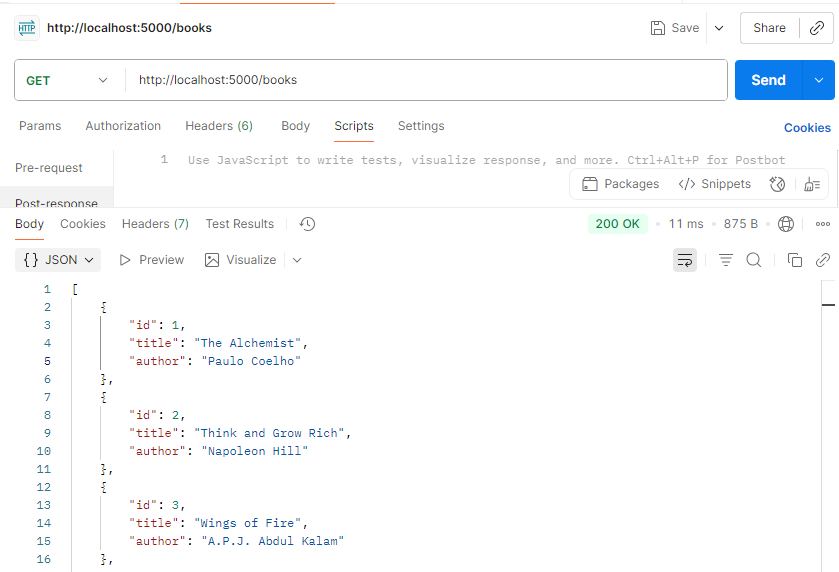
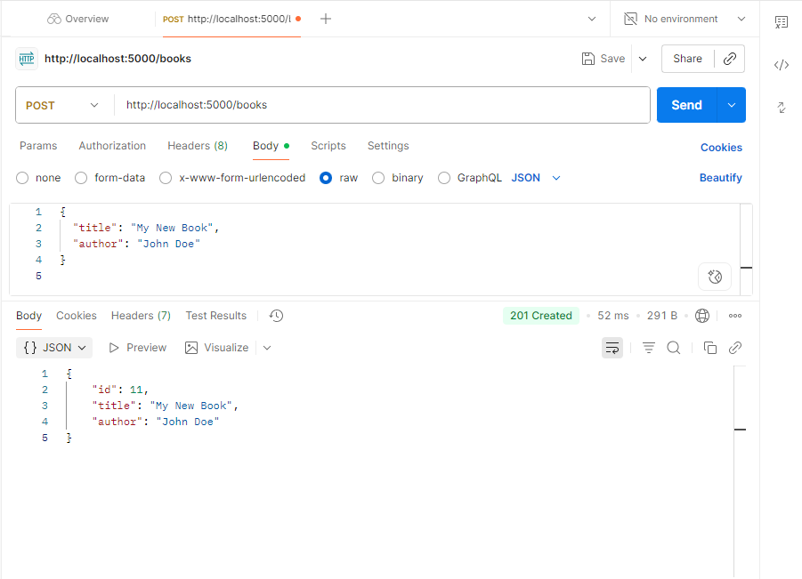

# 📚 Books REST API 

A simple REST API built with Node.js and Express to manage a list of books.

## 🚀 Features
- Get all books
- Get a book by ID
- Add a new book
- Update a book
- Delete a book

## 🛠 Tech
- Node.js
- Express.js

## ▶️ Run Locally
```bash
git clone https://github.com/Aamir211/Book-API
cd books-api
npm install
node server.js


## 📸 Screenshot
### GET /books




### POST /books

